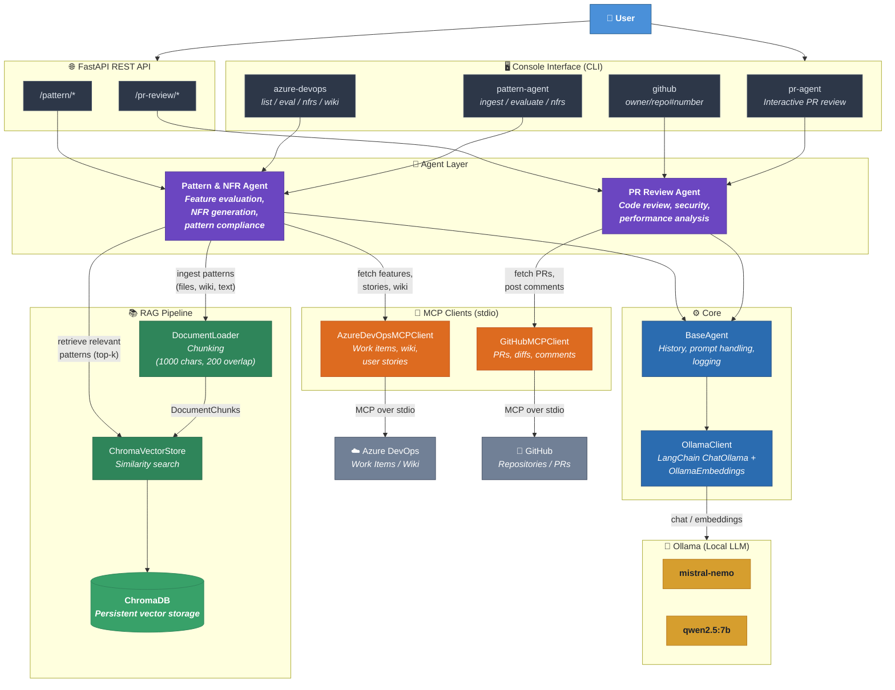

# Personal Agents — Architecture

## Flow Summary

| Flow | Path |
|------|------|
| **PR Review** | CLI / API → PR Review Agent → Ollama (mistral-nemo / qwen2.5) |
| **GitHub PR Review** | CLI / API → PR Review Agent → GitHub MCP → GitHub API → Ollama |
| **Feature Evaluation** | CLI / API → Pattern Agent → Azure DevOps MCP → RAG (ChromaDB) → Ollama |
| **NFR Generation** | CLI / API → Pattern Agent → Azure DevOps MCP → RAG (ChromaDB) → Ollama |
| **Pattern Ingestion** | CLI / API → DocumentLoader (chunking) → ChromaDB |
| **Wiki Ingestion** | CLI → Pattern Agent → Azure DevOps MCP → DocumentLoader → ChromaDB |
